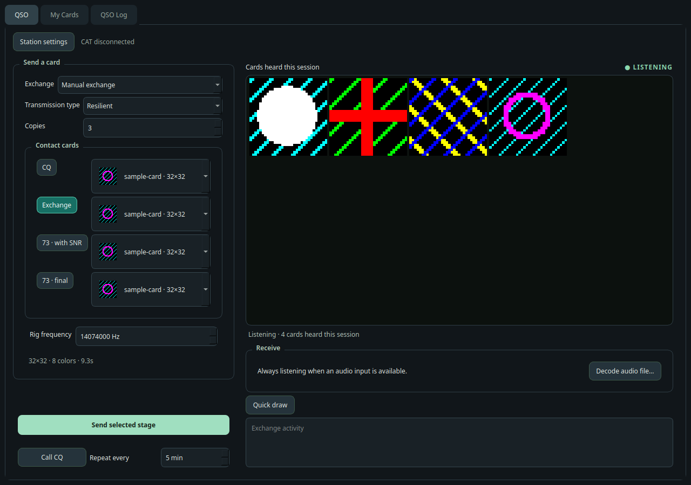
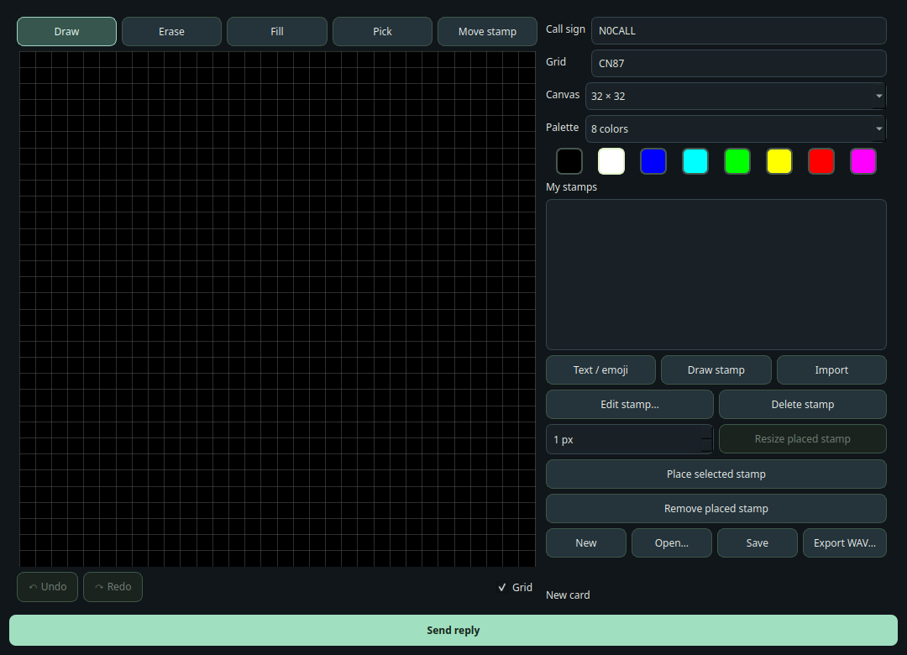
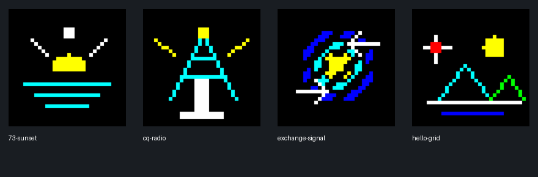

# Pixel QSO

Pixel QSO sends small QSO/QSL image cards over digital radio. It handles card
identity, fragment transfer, image assembly, previews, and QSO stages. Modems
with the Data2G label run through Data2G's supported host command and KISS
interfaces.

## Screenshots

| QSO session | Card editor |
| --- | --- |
|  |  |

Example cards made in the editor:



## Install and run

Python 3.10 or newer is required. The standard install includes the pinned
Data2G host runtime without PyTorch:

```sh
uv sync
uv run python app.py
```

With pip:

```sh
python -m pip install -r requirements-app.txt
python app.py
```

The app includes 16×16, 32×32, and 64×64 cards; 8-, 16-, and 32-color
palettes; drawing, text, and stamps; manual, automatic, and beacon exchanges;
and local card and QSO storage.

## Modem choices

Data2G is the default backend. After connecting, Pixel QSO lists the host's
advertised modes that its broadcast API accepts for this group and that have
enough frame capacity for a Pixel QSO card fragment. Each entry shows the exact
host mode name, bandwidth, and maximum application-frame size.

Pixel QSO's local Resilient, Fast, weak-signal, and legacy modems are available
through **Experimental modems** after enabling **Show experimental modem modes**
in Station settings. Local Resilient modes have an audio placement control that
sets the lowest tone; 300 Hz is the recommended starting offset. It does not
configure Data2G's audio placement.

The existing Resilient modes keep the version 3 on-air format for compatibility
with existing local-modem stations. **Resilient v4 · whole-image check** is a
separate experimental mode and sends a new version 4 format. Version 4 protects
the canonical packed palette raster's CRC32 and content tag in its header, adds
explicit block position/count fields, and accepts a complete image only after
all checked blocks match that raster identity. Version 3 remains decodable with
its original per-block CRC verification scope; it does not claim whole-image
checksum verification. Version 4 transmissions require a peer with v4 support.

## Data2G host

In Station settings, choose **Start local Data2G host** to have Pixel QSO start
the bundled host, or choose **Remote Data2G host** and enter a host address.
The defaults are command port 8300 and KISS port 8100. Pixel QSO discovers the
host's mode catalog, opens the shared `PIXELQSO` broadcast group, and validates
the catalog against that group's `BCAST MODE` support before showing choices.

For Data2G modes, Data2G owns radio audio and PTT. Pixel QSO releases its local
audio receiver and CAT connection while the host is selected. Local Resilient
modes continue using Pixel QSO's configured audio and CAT path. Do not connect
Pixel QSO to a Data2G instance whose single-client command port is already
owned by its GUI; use the managed host or a separate host instance instead.
ACKMODE confirms that a local frame finished transmitting; it does not confirm
that another station received the card. Group names and CRC masks are not
encryption or privacy. See [the host protocol notes](DATA2G-BROADCAST-NOTES.md)
for details on group and frame behavior.

Pixel QSO's internal adapter boundary records which component owns radio and
audio, what receive features are available, and what integrity evidence a
backend supplies. Data2G enters as checked application frames; experimental
local modems enter as decoded blocks or candidate pixels. Both feed the same
bounded card assembly service. Adding an experimental backend requires a known
Pixel QSO framing and integrity contract; arbitrary modem formats are not
automatically interoperable.

## Build

The frozen app includes the managed Data2G host runtime and experimental CPU
modems, while excluding PyTorch and GPU packages. It uses `icon.png` for the
app window, `icon.ico` for the Windows executable, and `icon.icns` for the macOS
app bundle:

```sh
uv sync
uv run --with PyInstaller python -m PyInstaller --clean --noconfirm pixelqso.spec
```

The one build contains `icon.png` and all CPU modes. Build on each target
operating system; desktop CI builds one package for Linux, Windows, and macOS.
The managed Data2G host is bundled in each platform build. On Linux the output
is `dist/PixelQSO`; on Windows it is `dist/PixelQSO.exe`; on macOS it is
`dist/PixelQSO.app`.
